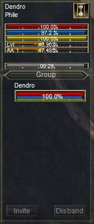

# DendroEQUI
Custom Everquest UI

Version: 1.0

Builds on the default UI.

Changes the Player Window:
- Adds Level exp bar labeled as 'Lvl'
- Adds AA exp bar labeled as 'AA', as well as unspent AA count

Changes to the Group Window:
- Adds the player to the top of the group window.

Screenshot of changes to group and player windows: 

